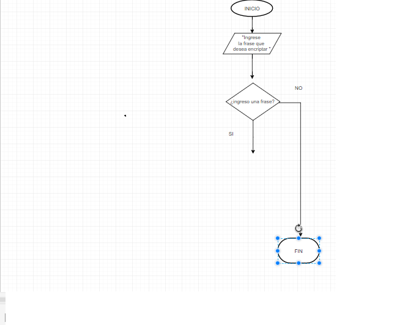

# CIFRADO Cesar
#### SE CREA DOS FUNCIONES
1. La primera **function** llamado **cipher()**

    Dentro se crea un **prompt** por el cual el usuario ingresara su frase  dentro de variable __var__ lo nombre **sentence** que es igual a **prompt** dentro se indica lo que hara el usuario.
>("Ingrese la frase, frase que desea encriptar ")

La frase por el usuario **var encryptSentence=sentence** se coloca en MAYUSCULAS **.toUpperCase()** por si el usuario ingresa todo en minuscula.

Continuacion la frase del usuario **var convertEncrypt** es igual **encryptSentence.split('');** donde se separa cara caracter.

le agregamos array vacio **var PushEnncrypt=[];** para que luego vaya entrando lo encriptado y le entramos con un **for(var i es igaul a 0; i es menor newToUpperCase.length;** que **i++** va agregando uno en uno )

La variable **var** llamado **newcharacterPosition** es igual a **newToUpperCase[i].charCodeAt();** que es quien devuelve un numero indicado el valor

  la variable **var characterPosition** es igual  **((newcharacterPosition-65+33)%26+65);** asi la nueva position tendra otro posicion encriptada que utilizamos la formula para encriptar
  Luego la variable
**var** llamado **pushPosition** es igual al characterPosition.String.fromCharCode();que devuelve a una cadena creada mediante el uso de la secuencia de valores

diagrama de flujo 
