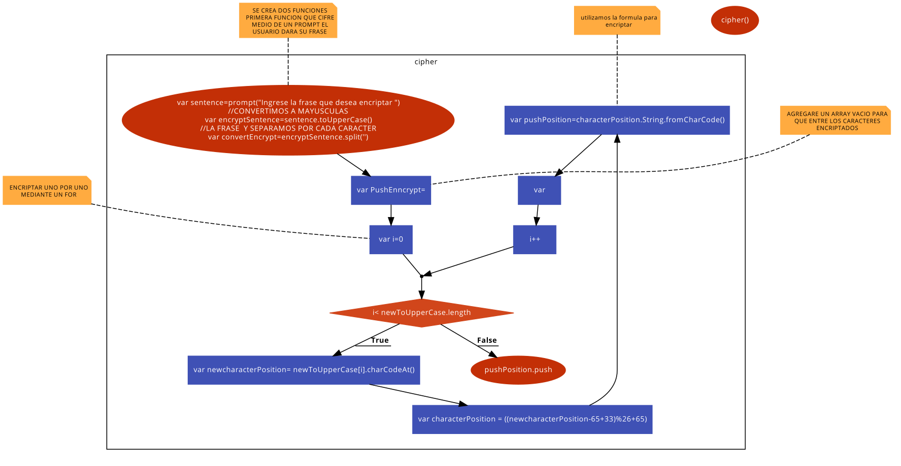

Cifrado César

> Recuerda seguir siempre esta [guía de estilos](https://github.com/Laboratoria/js-style-guide/)

Crea una web que pida, por medio de un `prompt()`, una frase al usuario y devuelva el mismo mensaje encriptado según el [algoritmo de Cifrado César](https://en.wikipedia.org/wiki/Caesar_cipher) con el parámetro de desplazamiento de **33 espacios hacia la derecha**

Por ejemplo:

- Texto original: `ABCDEFGHIJKLMNOPQRSTUVWXYZ`
- Texto codificado: `HIJKLMNOPQRSTUVWXYZABCDEFG`

# Entregables

Para cada producto debes entregar **un repositorio de GitHub** que contenga:

1. Archivo `README.md` que explique el **pseudocódigo** de tu solución y su **diagrama de flujo**
2. Archivo `app.js` con el **código** de tu solución
3. Archivo `index.html` vinculado con tu `app.js`

# Tips

A continuación un video de Michelle que te lleva a través de la fórmula matemática del Cifrado César y un par de cosas más que debes saber para resolver este reto. ¡Escúchala con detenimiento y sigue sus consejos! :)

[](https://www.youtube.com/watch?v=zd8eVrXhs7Y)

También te compartimos más información de lo que Michelle te ha explicado en el video anterior:

- [Aprende más sobre `charCodeAt()`](https://developer.mozilla.org/es/docs/Web/JavaScript/Referencia/Objetos_globales/String/charCodeAt)
- [Aprende más sobre `String.fromCharCode()`](https://developer.mozilla.org/es/docs/Web/JavaScript/Referencia/Objetos_globales/String/fromCharCode)
- [Aprende más sobre `ASCII`](http://conceptodefinicion.de/ascii/)

# Consideraciones específicas

1. Tu programa debe ser capaz de cifrar y descifrar tanto letras mayúsculas como minúsculas. La fórmula para descifrar es: `(x - n) % 26`
2. Tu código debe estar compuesto por 2 funciones con los siguientes nombres: `cipher` y `decipher`
3. El usuario no debe poder ingresar un campo vacío o que contenga números

# Criterios de evaluación

Se tomarán en cuenta las siguientes consideraciones a la hora de evaluar tu solución:

1. Nombramiento de variables
2. Indentación
3. Validación de input: el usuario no debe poder ingresar un campo vacío o de tipo que no corresponda
4. Estructura de tus archivos
5. Archivo `README.md` correctamente redactado
6. Uso de comentarios para hacer tu código más legible
7. Que el programa cumpla con el propósito requerido

# CIFRADO Cesar

## SE CREA DOS FUNCIONES

# SE CREA DOS FUNCIONES

1. Primera **function cipher(){** que se hace para cifrar y se hace una **var** lo nombramos **sentence** es igual a un **prompt("Ingrese la frase que desea cifrar ");**

  Se crea otra **var** nombrado **convertEncrypt** es igual a **sentence.split('');** la **var** se nombra **pushEnncrypt** es igual aun array vacio **[];** media un **for(var i** es igual **0;** **i**menor a **convertEncrypt.length;** i++){ la **var** nombrado **newcharacterPosition** es igual **convertEncrypt[i].charCodeAt();** utilizamos la formula para encriptar **var** nombrado **characterPosition** es igual **((newcharacterPosition** menos **65** más **33)** modulo **26** más **65);** devuelve una cadena creada mediante el uso de una secuencia de valores DE LA FORMULA QUE HICIMOS ARRIBA **var pushPosition=characterPosition.String.fromCharCode(characterPosition);** AHORA AGREGAMOS Y JUNTAMOS LO CIFRADO EN EL ARRAY VACIO

  ```
    **pushEnncrypt.push(pushPosition) && pushEnncrypt.join(pushPosition)**
  ```

  } y **return pushEnncrypt()** } llamamos la funcion **cipher()**

# SEGUNDA FUNCION QUE DECIFRA

1. la **function** llamada **decipher(){** ENTRAR UN PROMPT PARA QUE EL USUARIO ME DEVUELVA LO QUE SE LE indica con **var** nombrado **phrase** es igual **prompt("Ingresa lo que deseas decifrar");** LOS CARACTERES INGRESADOS SE SEPARAN mediante un **var phraseSplit** es igual a **phrase.split();** COLOCAMOS UN ARRAY VACIO PARA LUEGO EL DECIFRADO ENTRE **var pushDecipher** es igual a []; MEDIANTE UN FOR LO QUE INGRESO EL USUARIO COMENZARA A CONTAR UNO POR UNO **for (var i=0; i<phraseSplit.length;i++){** EL INDICE ES tODO LO QUE ENTRA EL USUARIO **var newDecipher=phraseSplit[i];** SE PONE LA FORMULA PARA DECIFRARLO **var starDecipher=(newDecipher - 33) % 26;** EL RESULTADO SE AGREGA Y JUNTA LOS CARACTERES AL ARRAY VACIO **pushDecipher.push(starDecipher) && pushDecipher.join(starDecipher); }** y **return pushDecipher()** RETONAR AL ARRAR VACIO **}** **decipher()** llamamos a la function

diagrama de flujo 
